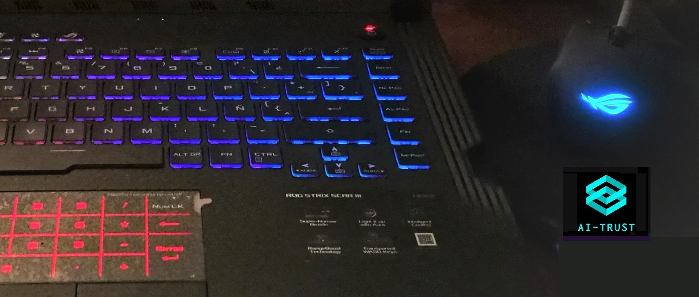

# data-csv
dataset datos abiertos

 

La mayoria de estos conjuntos de datos y kernels se tomaron de

https://www.kaggle.com/

Los cuadernos jupyter  se disponen  y son de fuente abierta

https://www.ai-trust.org
